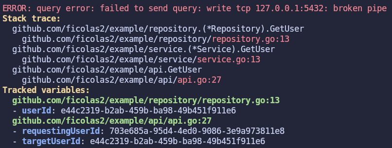

# Errtrace
## Overview


When debugging an error, you usually want two things:

1. **Where** it happened (and where it came from)  
2. **What** the relevant variables were at the time  

That way you can find **why** it happened, and maybe even **who** to blame! 😉

This library gives an **opinionated** way to make that easy.

It uses a backtrace to attach context (position and variables) to errors. This adds (a slight) overhead, so it's meant for **exceptional** errors. Not every error is exceptional.
For example, you wouldn’t trace a “not found” error if it's part of normal control flow. But you would trace unexpected or undesired failures that indicate something went wrong.

## Usage
### Trace errors
To trace an error:
```go
if err != nil {
    return errtrace.Wrap(err)
}
```
You can also add variables:
```go
if err != nil {
    return errtrace.WrapVar(err, map[string]any{"userId", userId})
}
```

### Configure
See [configuration Guide](docs/configure.md)

